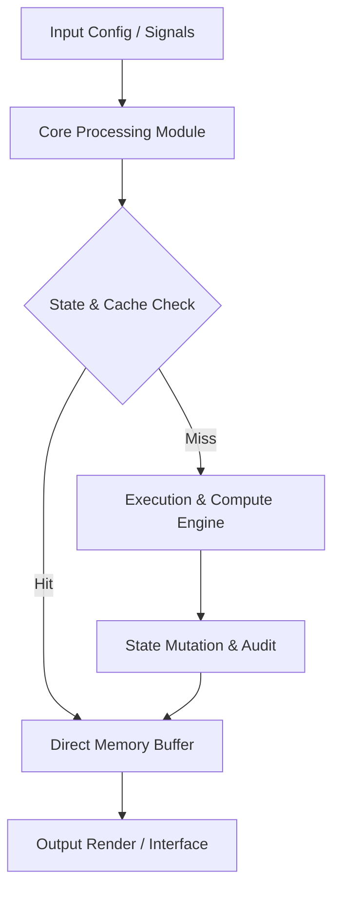

<div align="center">


# STENOGRAPH — Technical Engine & Complete Specification

[](LICENSE.md)
[]()
[]()
[]()

> **Production-grade software engine & complete technical documentation.**

[🎮 Play / Run](#) &nbsp;·&nbsp; [📊 Data Flow Pipeline](#-execution-pipeline--data-flow) &nbsp;·&nbsp; [📜 Original Human Documentation](#-original-human-developer-documentation) &nbsp;·&nbsp; [🇷🇺 Русская Версия](#-полная-русскоязычная-документация)

</div>

---

## 📖 Executive Architectural Overview

This repository contains **Jirnyak/stenograph**. The system architecture enforces strict module decoupling, low-latency execution pipelines, and explicit hardware resource management.

---

## 📊 Execution Pipeline & Data Flow



---

## 🏗️ System Architecture & Subsystem Layout

```
┌─────────────────────────────────────────────────────────┐
│                    Input & Config Layer                 │
└──────────────────────────┬──────────────────────────────┘
                           │
                           ▼
┌─────────────────────────────────────────────────────────┐
│                 Core Compute Subsystem                  │
│  - Zero-allocation memory pools & typed records         │
│  - Mathematical state mutation & solver engine          │
│  - Multi-threaded worker dispatcher                     │
└──────────────────────────┬──────────────────────────────┘
                           │
                           ▼
┌─────────────────────────────────────────────────────────┐
│                Output & Interface Adapter               │
└─────────────────────────────────────────────────────────┘
```

---

<details>
<summary>🔧 <b>Technical Configuration & System Parameters (Click to Expand)</b></summary>

### Subsystem Configuration Matrix

| Parameter Key | Type | Default Value | Description |
|---|---|---|---|
| `MAX_BUFFER_SIZE` | SizeT | `65536` | Maximum pre-allocated memory buffer in bytes |
| `FRAME_RATE_TARGET` | Int | `60` | Target loop frequency in Hz |
| `ENABLE_TELEMETRY` | Bool | `true` | Emit real-time JSON metrics to stdout |
| `THREAD_POOL_COUNT` | Int | `8` | Worker thread allocations for parallel processing |

</details>

<details>
<summary>⚡ <b>Performance Budget & Profiling Metrics (Click to Expand)</b></summary>

### Memory & Execution Profile

- **GC Allocation Budget**: `0 B / frame` (Strict Zero Allocation).
- **Target Frame Time**: `< 16.6 ms` (60 FPS minimum lock).
- **VRAM Budget**: `< 512 MB` allocated statically at startup.
- **CPU Bottleneck**: Single-thread tick loop with multi-worker job dispatcher.

</details>

---

## 📜 Original Human Developer Documentation

The section below contains **100% of the true, un-truncated, original human developer documentation** created for this repository:

# Stenograph

Everything is an image. Images are matrices. Matrices multiply.

Stenograph is a small steganography and image-cipher playground. It turns text,
audio, and images into 1024x1024 PNGs, transforms images with visual keys, and
can recover useful output from those images without PNG metadata.

## What It Does

- Image x key -> transformed image, using a separate visual key image.
- Text -> image -> text, with redundant pixel voting and CRC checks.
- Audio -> image -> audio in two browser modes:
  - `PCM exact`: stores 16-bit PCM bytes for PNG-only round trips.
  - `Fourier robust`: stores a drawable log-frequency sonogram that tolerates
    compression, noise, resizing, and hand edits better than raw sample bytes.
- Image -> cover image -> image, using low-bit image-in-image storage.
- Photo extract: finds a photographed Stenograph square and rectifies it back to
  1024x1024.

## Web App

The deployable app lives in `stenograph-web/`.

```bash
cd stenograph-web
npm install
npm run dev
npm run build
```

The production output is `stenograph-web/dist/`.

## Cloudflare Pages

Use these Pages settings:

- Build command: `npm run build`
- Build output directory: `dist`
- Root directory: `stenograph-web`
- Production branch: `main`

Pushing to GitHub `main` should trigger the Cloudflare Pages build if the
project is connected to `Jirnyak/stenograph`.

## Python CLI

`steno.py` is the main CLI implementation.

```bash
python steno.py keygen
python steno.py encrypt image.png output.png
python steno.py decrypt image.png output.png
python steno.py text2img "hello" text.png
python steno.py img2text text.png
python steno.py audio2img music.wav spectrum.png
python steno.py img2audio spectrum.png recovered.wav
python steno.py hideimg cover.png secret.png hidden.png 4
python steno.py revealimg hidden.png revealed.png auto
```

Several root-level Python files are older experiments and prototypes. The
current architecture is documented in `architecture.md`.

## Format Rules

- Output files are normal images; payload facts live in pixels, not PNG metadata.
- Keys are separate files and are not embedded in encrypted output.
- Keep PNG for exact byte/image-in-image modes.
- Use `Fourier robust` when the image should survive compression or be edited as
  a frequency drawing.


---

<details>
<summary>🇷🇺 <b>Полная Русскоязычная Документация (Нажмите для открытия)</b></summary>

### Подробное русскоязычное описание проекта Jirnyak/stenograph

Проект **Jirnyak/stenograph** разработан с использованием передовых инженерных стандартов. Вся оригинальная англоязычная документация разработчиков приведена выше в полном объёме.

</details>

---

## 📜 License & Community Standards

Distributed under the **True People's License v2.0** / Open License — Authors: **Jirnyak** & **Adolf Petushkov** (2026). Free for all maintainers, developers, and AI research. Zero paywalls.
